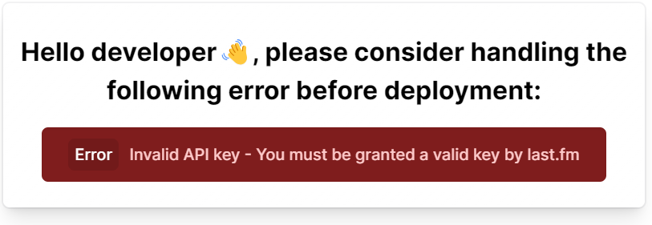
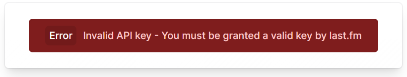

<p>
  
</p>

# @lastfm-viewer/solid

> [!NOTE]
> This repository is now part of a monorepo if you want to start developing on it go to the original monorepo [here](https://github.com/ZOASR/lastfm-viewer)

## Homepage: [lastfm-viewer.vercel.app](https://lastfm-viewer.vercel.app)

<p align="center" >
  
</p>

<p align="center" >

<a href="https://www.npmjs.com/package/@lastfm-viewer/solid" alt="@lastfm-viewer/solid(npm)">
</a>
</p>

A solidjs component to view recent scrobbles for a last.fm user

<p align="center">
  
  
</p>

## Quick start

Install it:

```bash
npm i @lastfm-viewer/solid
# or
yarn add @lastfm-viewer/solid
# or
pnpm add @lastfm-viewer/solid
# or
bun i @lastfm-viewer/solid
```

## Use it:

to start using the component you first need to get a last.fm API key from [here](https://www.last.fm/api), once you've done that just import the component and specify the username of the user you want to get scrobbling information from:

> Please note that some users set their profile stats to private, so not every user is applicable, if you're using this component on your personal account just set your "Recent listening" stats to public [here](https://www.last.fm/settings/privacy)

```tsx
import SolidLastFMViewer from "@lastfm-viewer/solid";

function App() {
	return (
		<>
			<SolidLastFMViewer user="[username]" api_key="[API_KEY]" />
		</>
	);
}
```

<p align="center">
	<div style="height: 4px; background: #2c4f7c; width: 80%; margin: 0 auto; border-radius: 5px"></div>
 </p>

## Props:

### `user: string` :

last.fm username

<p align="center">
	<div style="height: 4px; background: #2c4f7c; width: 50%; margin: 0 auto; border-radius: 5px"></div>
 </p>

### `api_key: string` :

your last.fm public api key

<p align="center">
	<div style="height: 4px; background: #2c4f7c; width: 50%; margin: 0 auto; border-radius: 5px"></div>
 </p>

### `updateInterval?: number` :

if you want to frequently fetch the user's listening info just specify the `updateInterval` prop. (milliseconds) (it takes a number that determines the update interval):

```tsx
import SolidLastFMViewer from "@lastfm-viewer/solid";

function App() {
	return (
		<>
			<SolidLastFMViewer
				user="[username]"
				api_key="[API_KEY]"
				updateInterval={20000} {/* 20 seconds */}
			/>
		</>
	);
}
```

> [!CAUTION]
> setting the `updateInterval` prop to a low number might subject your api key for termination, to avoid this just use a higher more reasonable number.

<p align="center">
	<div style="height: 4px; background: #2c4f7c; width: 50%; margin: 0 auto; border-radius: 5px"></div>
 </p>

### `mode?: ("dev" | "prod")` = `"dev"` :

The default value for this prop is: `"dev"`

when using `"dev"` mode any error that haapens will be viewed with the following message above it:

`Hello developer👋, please consider handling the following error before deployment:`



when using `"prod"` mode the error is shown as is:


